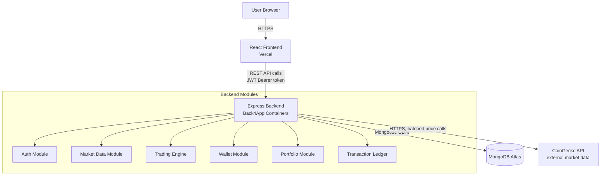
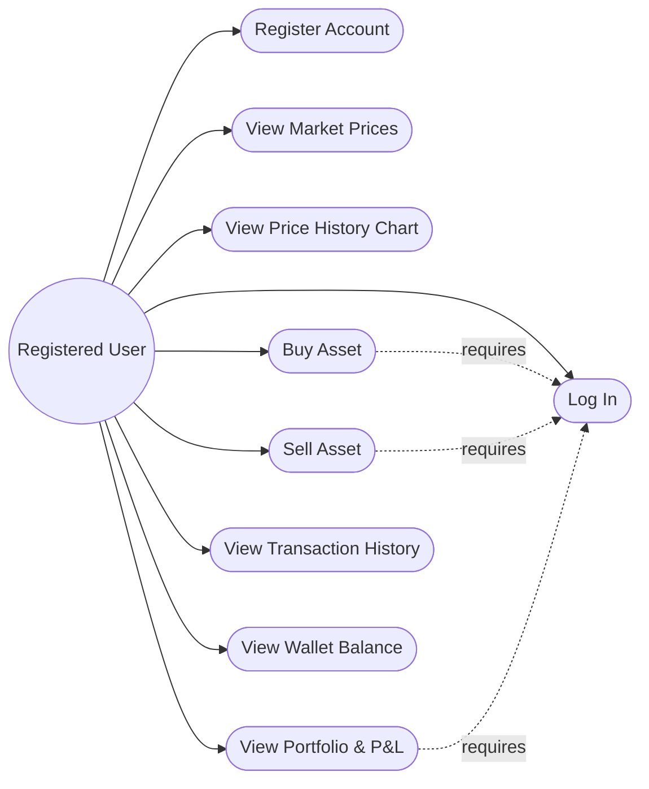
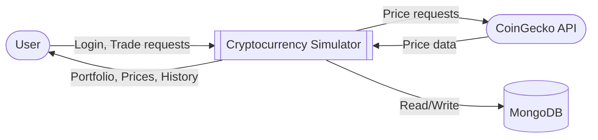
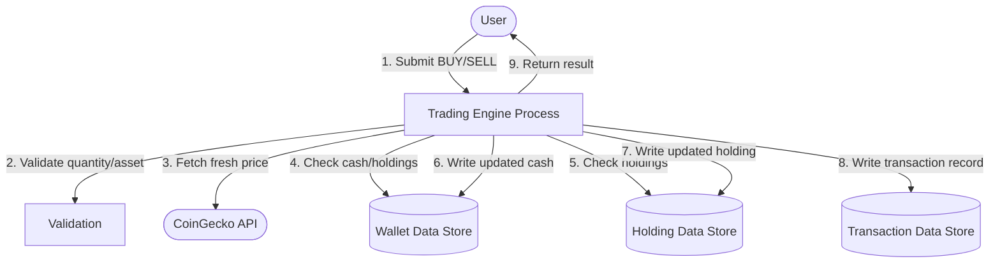
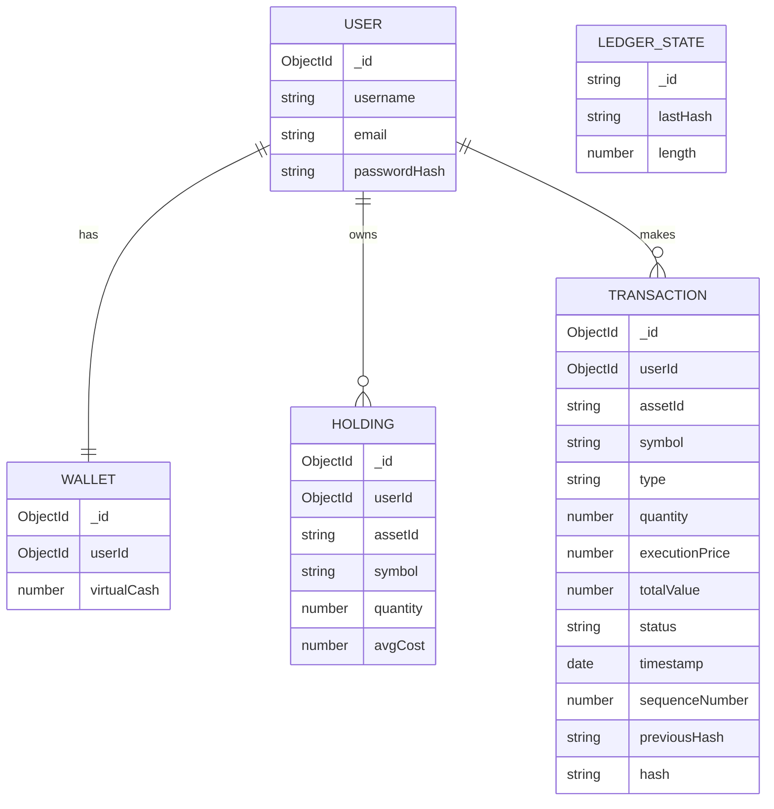
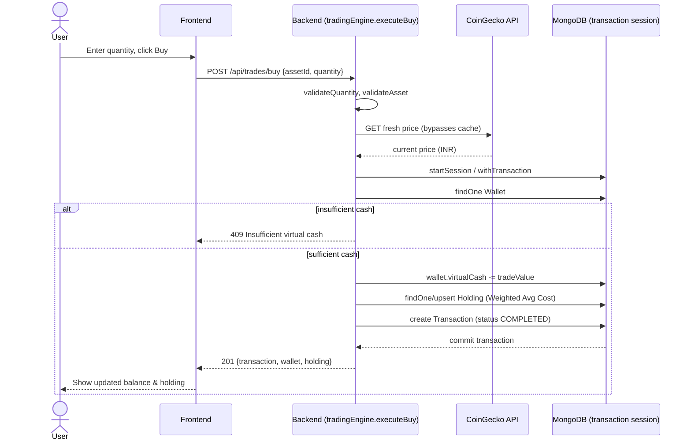
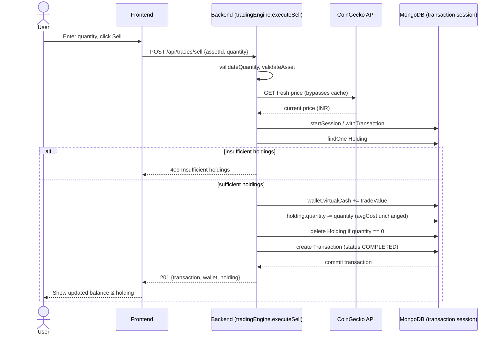

# Diagrams

All diagrams below are Mermaid — they render natively on GitHub. For the
final report, screenshot them from GitHub or export via
[mermaid.live](https://mermaid.live) (paste the code block in).

These match the **actual implemented system**, not the original proposal.

---

## 1. Architecture Diagram

## 2. Use-Case Diagram

## 3. Data Flow Diagram — Level 0 (Context)

## 4. Data Flow Diagram — Level 1 (BUY/SELL focus)

## 5. ER / Database Diagram

`LEDGER_STATE` is a singleton document (global, not per-user) tracking
the current end of the hash chain — see `docs/blockchain-module.md`.

## 6. BUY Sequence Diagram

## 7. SELL Sequence Diagram

